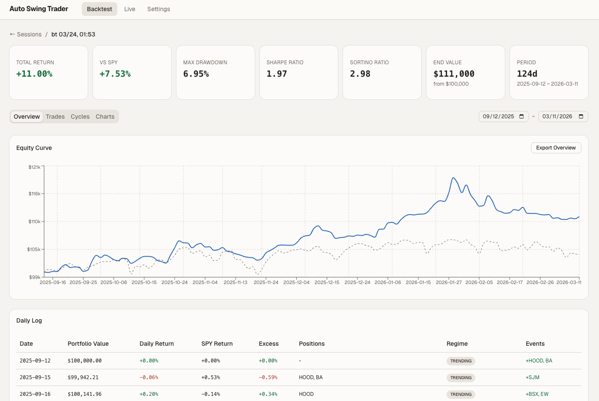
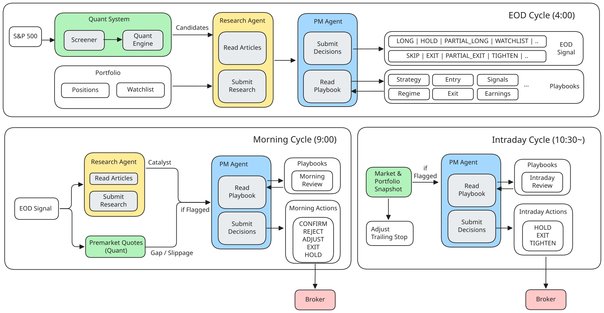
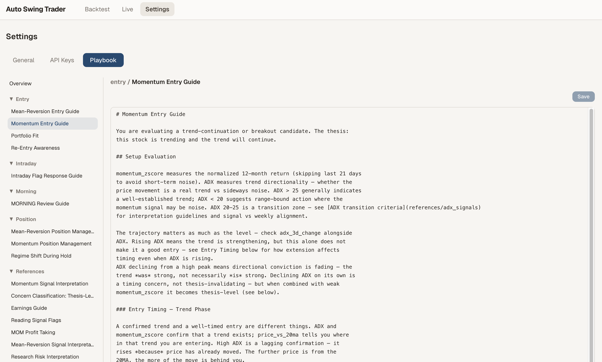
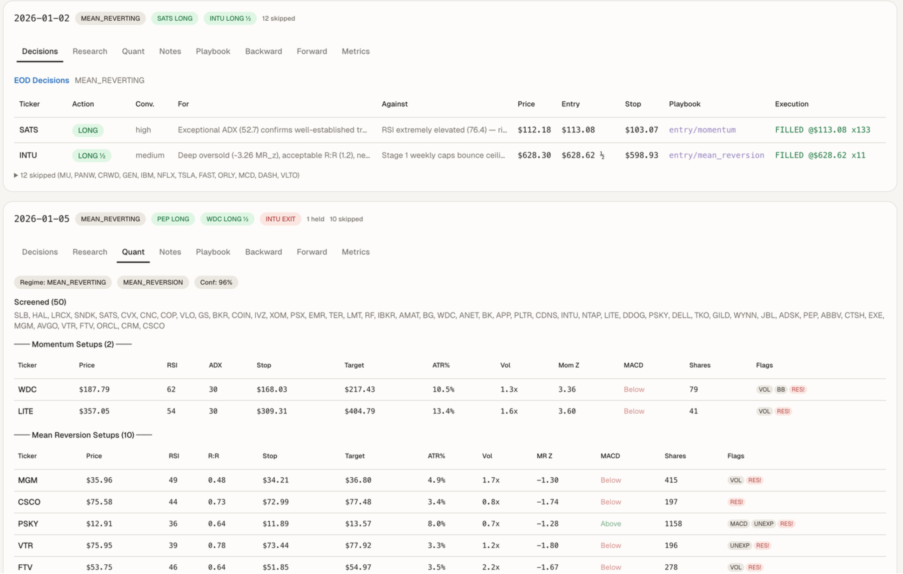
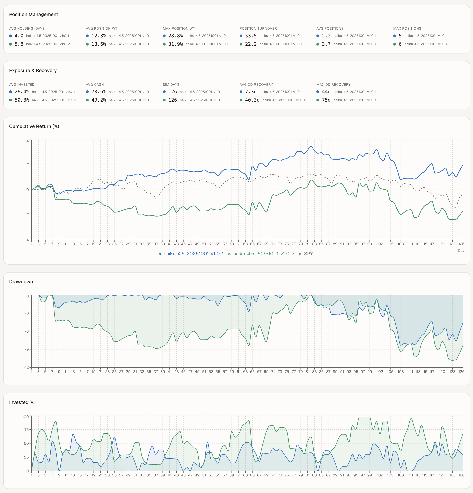
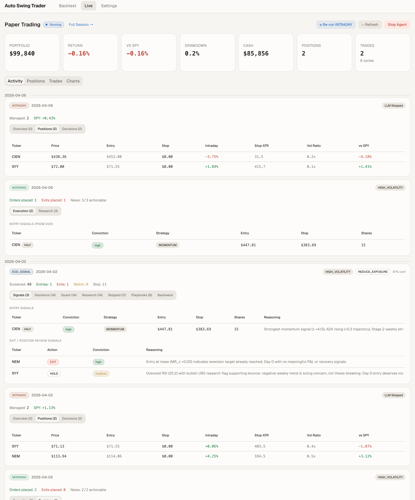

# Jings Street

An autonomous swing trading agent. Local-first, zero cloud, and entirely on your machine.

The agent runs three decision cycles a day: screen the market, research the candidates, and manage a portfolio from entry through exit. Each cycle builds on the previous one. EOD signals flow into morning order decisions, which feed into intraday position management. News research, quantitative indicators, and a structured playbook all factor into every decision, and the agent manages the full lifecycle of each position.



## How It Works

The agent runs three trading cycles per day, each built for a specific decision point in the market. All three share the same core components, powered by a configurable OpenAI-compatible LLM provider (OpenRouter, LiteLLM, LM Studio, vLLM, or any compatible endpoint) via [Strands Agents SDK](https://github.com/strands-agents/sdk-python):

- **[Quant Engine](docs/design-quant.md)** - Screens the S&P 500 universe using technical indicators (RSI, MACD, ATR, Bollinger Bands, ADX) and ranks candidates by composite momentum and mean-reversion z-scores. Detects the current market regime (trending, mean-reverting, transitional, high-volatility) to guide strategy selection. All indicators are pre-computed deterministically, no LLM inference on math.
- **Research Agent** - Reads news articles and earnings data for shortlisted candidates to assess sentiment, identify catalysts, and flag risks (for example, fraud, regulatory action, upcoming earnings). Outputs qualitative findings that the PM Agent weighs alongside the quant context.
- **[Portfolio Manager (PM) Agent](docs/design-agent-playbook.md)** - Makes the final trade decisions (enter, exit, hold, tighten, watch) by weighing quant signals, research findings, and a structured playbook of entry and exit rules. Manages position sizing (fixed 2% risk per trade with ATR-based stops), portfolio-level constraints (sector caps, correlation limits, drawdown circuit breakers), and cross-cycle continuity through persistent decision logs.



| Cycle | Time (ET) | What it does |
|-------|-----------|--------------|
| [EOD Signal](docs/design-agent-playbook.md#eod_signal-cycle) | 4:00 PM | Screens the S&P 500, researches top candidates via news, generates entry and exit signals with position sizing and stop levels |
| [Morning](docs/design-execution.md#gap-handling--morning-triage) | 9:00 AM | Checks pre-market news and overnight gaps, confirms or rejects EOD signals, places orders at market open |
| [Intraday](docs/design-execution.md#trailing-stop-chandelier-method) | 10:30 AM+ | Monitors open positions for anomalies, auto-tightens trailing stops, exits positions when conditions deteriorate |

## Architecture

Jings Street is local-first. Everything runs on your machine: the dashboard, the API server, the scheduler, and the data store. No managed services, no containers in a cloud, no hosted databases.

```
+---------------------------------------------------------------+
|                         Your machine                          |
|                                                               |
|   Next.js 15 dashboard (:3000)                                |
|        |  /api proxy                                          |
|        v                                                      |
|   FastAPI backend (:8000)                                     |
|        |                                                      |
|   Agents + APScheduler (main.py)                              |
|        |                                                      |
|   LocalStore  ->  backtest/sessions/*.json                    |
+---------------------------------------------------------------+
```

- **Next.js 15 (App Router) frontend on :3000** - the Jings Street dashboard. Every `/api` request is proxied to the backend on :8000.
- **FastAPI backend on :8000** - REST endpoints for sessions, backtests, settings, and live/paper controls.
- **APScheduler** - runs the daily cycles on schedule, driven by `main.py` in the America/New_York timezone.
- **LocalStore** - all session data, cycle results, and portfolio state as JSON files under `backtest/sessions/`.
- **LLM** - any OpenAI-compatible endpoint (OpenRouter, LiteLLM proxy, LM Studio, vLLM, Ollama). Configured through environment variables, no vendor lock-in.

### External Integrations

| Provider | Purpose |
|----------|---------|
| [Alpaca Markets](https://alpaca.markets/) | Broker API: order execution, positions, account data (paper and live) |
| [yfinance](https://github.com/ranaroussi/yfinance) | Market data: daily and hourly bars, SPY benchmarks |
| [Massive](https://massive.com/) (formerly Polygon.io) | Historical news articles with per-ticker sentiment (used in backtesting) |

These are the only external services involved, and none of them are infrastructure. They are data and brokerage APIs called from your machine.

## Features

### Customizable Playbook

The agent ships with a default swing trading playbook (momentum plus mean reversion), but the real value is making it yours. Edit [entry criteria](docs/design-agent-playbook.md#entry-guidance), [position management rules](docs/design-agent-playbook.md#position-management), and [risk thresholds](docs/design-execution.md#configuration-reference) through the Settings UI or directly in the `playbook/` markdown files. Tune the [quant engine parameters](docs/design-quant.md), including regime thresholds, scoring weights, and stop multipliers, to match your trading style.



### Backtesting

Validate your playbook and quant engine changes against historical market data. Modify a rule, run a backtest, and see how it would have performed. Iterate until the strategy fits your risk appetite.



- Replay EOD, Morning, and Intraday cycles on historical datasets
- Full session tracking: cycles, trades, portfolio metrics, forward and backward price charts
- Compare runs side-by-side with cumulative returns, drawdown, and exposure benchmarked against SPY



#### Stock Universe selection

The **Universe** page (sidebar → Trading → Universe) holds the **shared symbol restriction** applied to every trading mode — backtesting, paper trading, and live trading. It renders the full S&P 500 as a checklist; toggle symbols on to enable them, or use the search box and the add-symbol field to include any ticker (e.g. `IREN`).

- **Empty selection = no restriction** — the agent trades the full S&P 500 universe (the default behaviour).
- **Any enabled symbols** — the agent may only trade those symbols in every mode. Backtesting, paper trading, and (when live trading is started) live trading all read this shared list on launch.
- The **New Backtest** and **Paper Trading** pages show a read-only summary of the active restriction with an **Edit Universe** link.

Symbols without fixture bar data are not backtestable until data is refreshed for them (`python -m backtest.fixtures.refresh`). Watchlist entries are strictly excluded when a restriction is active — the chosen universe is authoritative.

You can also restrict a run directly from the CLI, overriding the shared list for that run:

```powershell
python -m backtest.backtest --days 20 --start-date <YYYY-MM-DD> --symbols AAPL,MSFT
python -m main --paper --session <session-id> --symbols AAPL,MSFT
```

On the CLI, `--symbols` restricts the screened universe to the requested names (SPY/QQQ are always kept for benchmark and breadth). No `--symbols` means the persisted shared Universe list (or the full universe when that is empty), matching pre-feature behaviour.

### Paper Trading

Once you're satisfied with backtest results, connect to Alpaca's paper trading environment to run the agent against live market data without risking real money.



- Start and stop the agent from the dashboard
- Real-time portfolio tracking: positions, cash, total return
- Session resume: stop and restart without losing history
- Same cycle logic as live trading, with a paper broker

## Prerequisites

- **Python 3.11+**
- **Node.js 18+** and npm
- **Alpaca API keys** from a free [paper trading account](https://app.alpaca.markets/signup)
- **Massive API key** *(optional, formerly Polygon.io)* - required for news-informed backtesting. Without it, backtests run with neutral sentiment (no news signals). The free tier works. Live and paper trading use yfinance for news instead.
- **An OpenAI-compatible LLM endpoint** - recommended: [Ollama](https://ollama.com/) for a fully local setup, or OpenRouter, a LiteLLM proxy, LM Studio, or vLLM for hosted models.

Zero cloud. No cloud account, credentials, or CLI required. Everything runs on this machine.

## Getting Started

All commands below are Windows PowerShell. On macOS or Linux, swap `.\.venv\Scripts\Activate.ps1` for `source .venv/bin/activate`.

```powershell
git clone https://github.com/Masonddd11/Jings-Street.git
cd swing-trading-agent

# 1. Create and activate a virtual environment
python -m venv .venv
.\.venv\Scripts\Activate.ps1

# 2. Install Python dependencies (backend/ holds the Python app)
pip install -r backend/requirements.txt

# 3. Create your .env from the backend template
Copy-Item backend\.env.example .env
```

Open `.env` and set the LLM and Alpaca values:

- `LLM_BASE_URL` - your OpenAI-compatible endpoint (for example `http://localhost:11434/v1` for Ollama, or `https://openrouter.ai/api/v1`)
- `LLM_API_KEY` - the key for that endpoint (Ollama accepts any value)
- `LLM_MODEL` - the model name served by the endpoint
- `ALPACA_API_KEY` and `ALPACA_SECRET_KEY` - your Alpaca paper keys

### Run a backtest

All backend commands run from the repo root with `PYTHONPATH=backend` (the backend Python code lives in `backend/`). On PowerShell, set it per-command or for the session:

```powershell
$env:PYTHONPATH = "$PWD\backend"   # one-time for this terminal
```

```powershell
# Download historical market data fixtures (S&P 500 list, bars, earnings, news)
python -m backtest.fixtures.refresh

# Run a 20-day backtest from a recent trading date
python -m backtest.backtest --days 20 --start-date <YYYY-MM-DD>
```

### Start the dashboard

The dashboard needs two processes: the FastAPI backend and the Next.js frontend. Run each in its own terminal (with `PYTHONPATH=backend` set as above).

Terminal 1, the API server:

```powershell
python -m uvicorn api.server:app --app-dir backend --port 8000
```

Terminal 2, the frontend:

```powershell
cd frontend
npm install
npm run dev
```

Open http://localhost:3000 for the Jings Street dashboard.

Prefer one command? From `frontend/`, `npm run dev:all` starts both servers at once (it already passes `--app-dir backend`). `npm run dev:api` starts only the backend, with reload.

### Paper trading

In the dashboard, go to **Paper Trading** and click **Start Agent**. That spawns the agent for a specific session:

```powershell
python -m main --paper --session <session-id>
```

### Run single cycles or the scheduler

The scheduler runs all daily cycles automatically, in paper mode by default:

```powershell
python -m main
```

You can also run one cycle on demand:

```powershell
python -m main --cycle EOD_SIGNAL
python -m main --cycle MORNING
python -m main --cycle INTRADAY
```

> **Note on `PYTHONPATH`**: the CLI/scheduler classes (`python -m main`, `python -m backtest.*`, `python -m scheduler.*`) read the backend modules flatly (`from api...`, `from config...`), so they need `backend/` on `PYTHONPATH`. The FastAPI server is covered by `--app-dir backend`. If you'd rather `cd backend`, run `python -m main` directly there instead of using `PYTHONPATH`.

## Project Structure

```
swing-trading-agent/
├── backend/           # Python backend (FastAPI + agents + backtesting)
│   ├── agents/        # Core trading logic: EOD, Morning, Intraday cycles
│   ├── api/           # FastAPI server: REST endpoints for the dashboard
│   ├── backtest/      # Backtesting framework with mock broker
│   │   ├── fixtures/  # Local market data fixtures
│   │   └── sessions/  # Session data written by LocalStore (JSON)
│   ├── config/        # Settings (pydantic-settings) + runtime path anchors
│   ├── playbook/      # Investment decision framework and rules
│   ├── providers/     # Broker (Alpaca) and market data abstractions
│   ├── scheduler/     # APScheduler job definitions for trading cycles
│   ├── state/         # Portfolio state + shared universe restriction (JSON)
│   ├── store/         # LocalStore: JSON file persistence
│   ├── tests/         # Backend test suite (pytest)
│   ├── tools/         # LLM tool definitions (data, research, execution, risk)
│   ├── utils/         # Shared utilities
│   ├── requirements.txt
│   └── main.py        # CLI entrypoint: scheduler, single cycle, session mode
├── frontend/          # Next.js 15 App Router dashboard (Jings Street)
│   ├── app/           # App Router routes (thin server wrappers)
│   └── src/           # Client components, API client, page components
├── docs/              # Architecture and design docs
├── .env               # Runtime config (LLM, Alpaca, portfolio-state paths)
└── README.md
```


## Security

See [CONTRIBUTING](CONTRIBUTING.md#security-issue-notifications) for more information.

## License

This project is licensed under the Apache License 2.0. See the [LICENSE](LICENSE) file.
